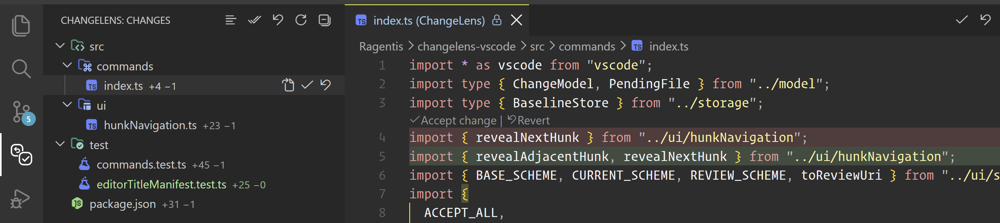

# ChangeLens

**See what changed. Decide what stays.**

ChangeLens is an open-source VS Code extension for reviewing changes made by AI coding agents, one hunk at a time.

   

When an agent edits your workspace, the changes land in your files immediately. Git shows you the sum of everything since your last commit — your work and the agent's, mixed together. ChangeLens keeps its own baseline of the workspace and shows only what changed from outside your editor, so you can read each block and accept or revert it.

It works with any agent that writes to workspace files. Review state stays local, with no provider integration, remote service, commits, or staging required.

## How it works

On first activation ChangeLens captures a baseline of every in-scope file. From then on:

- **Writes from outside the editor** — from an agent or another external process — become pending changes you review.
- **Edits you make in VS Code** are folded into the baseline as you type. Those edits do not appear as pending changes or absorb existing ones nearby.
- **File operations you perform in the editor** — creating, deleting, renaming — are adopted rather than reported.

The baseline lives in the extension's own storage, not in your workspace and not in Git. ChangeLens adds no metadata to your repository, collects no telemetry, and makes no network requests.

## Reviewing

Pending files appear in the **ChangeLens** view in the activity bar, grouped as a tree or a flat list.

Opening a text change shows it in one of two review modes:

- **Unified** (default) — a single read-only editor that opens at the first changed block, with removed lines kept in place directly above the lines that replaced them, in full file context.
- **Diff editor** — VS Code's built-in diff editor.

Review documents keep the file's syntax highlighting. For supported languages, validation is kept off the synthetic review document so deleted lines do not produce misleading errors.

Toggle between them with **ChangeLens: Toggle Review Mode**. The choice is remembered per workspace.

Each block carries **Accept** and **Revert** CodeLens actions. The same actions are available in the regular editor while a file has pending changes, in the editor title menu, and as **Accept/Revert Block at Cursor** for keybinding.

- **Accept** adopts the current content as the new baseline. Nothing on disk changes.
- **Revert** restores the baseline content. For a modified file the change is applied to the editor buffer and left unsaved, so a plain undo takes it back. Reverting a file the agent added deletes it, after a confirmation. Reverting a file the agent deleted recreates it byte for byte.

After a successful block action, ChangeLens moves the cursor to the next remaining block by default. Turn this off with `changelens.jumpToNextChange`.

Reverting is refused when the file no longer holds what the diff was computed from, so a change that arrived while you were reading is never overwritten silently.

## Files without content

Binary files, and files above `changelens.maxFileSizeKb`, are tracked by size and modification time rather than content. They still appear when they change, marked with the reason, but they carry no diff. When the current file still exists, opening it uses VS Code's normal file handling. A newly added contentless file can be reverted by deleting it after confirmation; a modified or deleted one cannot be restored because ChangeLens has no previous content for it. Accepting one adopts its current whole-file state as the new baseline.

## Scope

A file is tracked when it is inside an open workspace folder and matched by neither:

- the `.gitignore` at that folder's root, when `changelens.respectGitignore` is on. Nested `.gitignore` files are not read, and — as in Git — a negation cannot re-include a file inside an excluded directory.
- any pattern in `changelens.exclude`. These are applied after `.gitignore`, so a `.gitignore` negation cannot undo one.

Files that leave scope keep their baselines, so bringing them back does not silently accept whatever changed while they were hidden.

## Git changes

A pull, merge, rebase, branch switch, or hard reset rewrites files, and those writes are not agent changes. ChangeLens watches the HEAD and the reflog that govern each folder — including worktrees and submodules — and folds Git's writes into the baseline instead of showing them for review.

Only the files Git actually rewrote are folded in, named by comparing the commits HEAD moved between, so anything Git did not touch stays pending. A file is adopted only while it still holds what Git left there, judged by its size and modification time. A write that lands while Git's work is being folded in is left for review instead.

- **A commit is not a review.** Committing rewrites nothing on disk, so an agent's change stays pending after you commit it. It stops being pending the next time Git rewrites that file — a pull, a rebase, or switching branches away and back — because Git's version of the file then becomes the baseline as a whole. Review before you commit, or the review lasts only until Git next writes the file.
- **Uncommitted changes are never taken.** Git refuses to overwrite a locally modified file, so a change you have not accepted is either left alone by Git or excluded because the file no longer matches HEAD.
- **Conflicts resolve themselves.** A merge that stops on a conflict has not moved HEAD, so the files Git left behind stay visible while you work through them. Committing the merge folds the whole merge in, and aborting it restores what the baseline was captured from.
- **A pull made while the window was closed** is recognised the next time the window opens.

This rests on the reflog, which Git keeps by default in every repository with a working tree. Where it has been switched off with `core.logAllRefUpdates`, nothing records what moved HEAD, and a pull cannot be told apart from a commit of work you have not reviewed — so ChangeLens guesses at neither. It still recognises branch switches, which move HEAD itself, and falls back to resetting the whole baseline after asking. Files a pull rewrites on the current branch stay pending there.

## Commands

| Command | What it does |
| --- | --- |
| ChangeLens: Refresh | Re-scans every in-scope file for external changes |
| ChangeLens: Accept / Revert File | Acts on the whole file |
| ChangeLens: Accept / Revert All | Acts on every pending file, after confirmation |
| ChangeLens: Accept / Revert Block at Cursor | Acts on the block the cursor is inside |
| ChangeLens: Toggle Review Mode | Switches between the unified view and the diff editor |
| ChangeLens: Show as List / Show as Tree | Switches how the view groups files |
| ChangeLens: Reset Baseline to Current Workspace | Treats everything pending as accepted |

## Settings

| Setting | Default | What it does |
| --- | --- | --- |
| `changelens.defaultReviewMode` | `unified` | How a text change opens, until the toggle is used |
| `changelens.jumpToNextChange` | `true` | Move the cursor to the next remaining block after accepting or reverting a block |
| `changelens.defaultViewMode` | `tree` | How the view groups files, until its toggle is used |
| `changelens.autoReveal` | `true` | Select the active editor's file in the view |
| `changelens.showCodeLensInEditor` | `true` | Accept/Revert CodeLens above pending blocks in the regular editor |
| `changelens.decorateEditor` | `true` | Highlight pending added lines in the regular editor |
| `changelens.respectGitignore` | `true` | Exclude files matched by each workspace folder's root `.gitignore` |
| `changelens.exclude` | `.git`, `node_modules`, `dist`, `out`, `build`, lockfiles | Additional glob patterns excluded from tracking |
| `changelens.maxFileSizeKb` | `512` | Files larger than this are tracked without content baselines |
| `changelens.maxTrackedFiles` | `20000` | Warns when the baseline grows past this |

## Requirements

- VS Code 1.100.0 or later on desktop.
- A trusted, file-backed workspace. ChangeLens stays disabled in Restricted Mode and in virtual workspaces because reverting writes to workspace files.
- Git is not required. When available, ChangeLens uses it only to locate the governing HEAD for branch changes.

## Install

Search for **ChangeLens** in the Extensions view, or install it from the [Visual Studio Marketplace](https://marketplace.visualstudio.com/items?itemName=ragentis.changelens) or [Open VSX](https://open-vsx.org/extension/ragentis/changelens/).

To install a downloaded `.vsix` by hand:

1. Run **Extensions: Install from VSIX...** from the Command Palette.
2. Select the `.vsix` file.

## Known limits

- Only the `.gitignore` at each workspace folder's root is read; nested ones are not.
- Git commands that rewrite files without moving HEAD — `git stash pop`, `git restore`, `git checkout -- <file>` — are reviewed as external changes, because nothing identifies them as Git's work.
- Files Git updates inside a submodule are reviewed as external changes. A parent repository's commits name the submodule, not the files in it.
- A file or folder moved outside the editor is reviewed as a deletion at the old path and an addition at the new one. ChangeLens does not detect renames.
- If a capture fails at startup, the window is not tracked until it is reloaded.

## Security

Baseline content is stored in VS Code's extension storage and is not encrypted. Anyone who can read your user profile can read it. The extension has no runtime dependencies, telemetry, or network access. The only external program it runs is `git`, without a shell, to read where each folder's HEAD stands and which files a Git operation rewrote.

See [SECURITY.md](SECURITY.md) for the complete data boundary and vulnerability reporting instructions.

## License

MIT. See [LICENSE](LICENSE).
